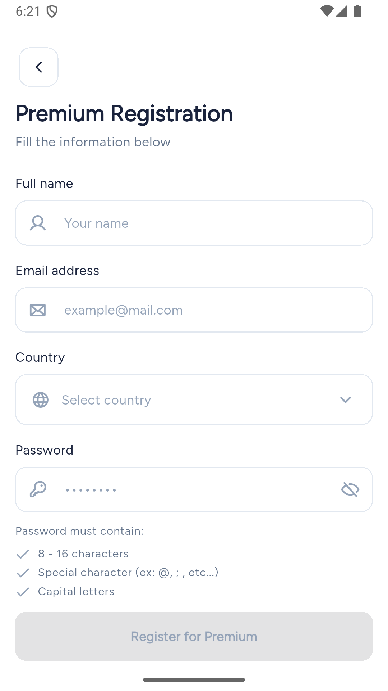
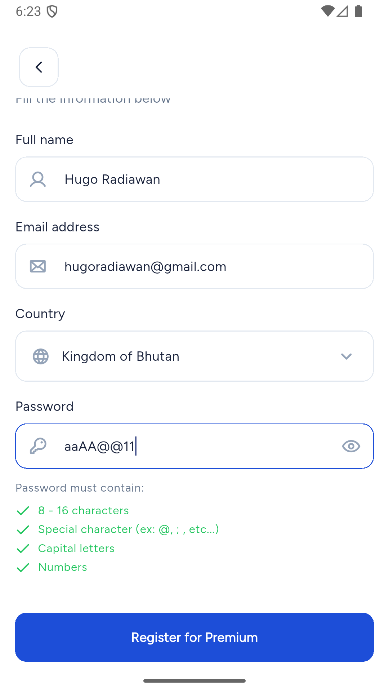
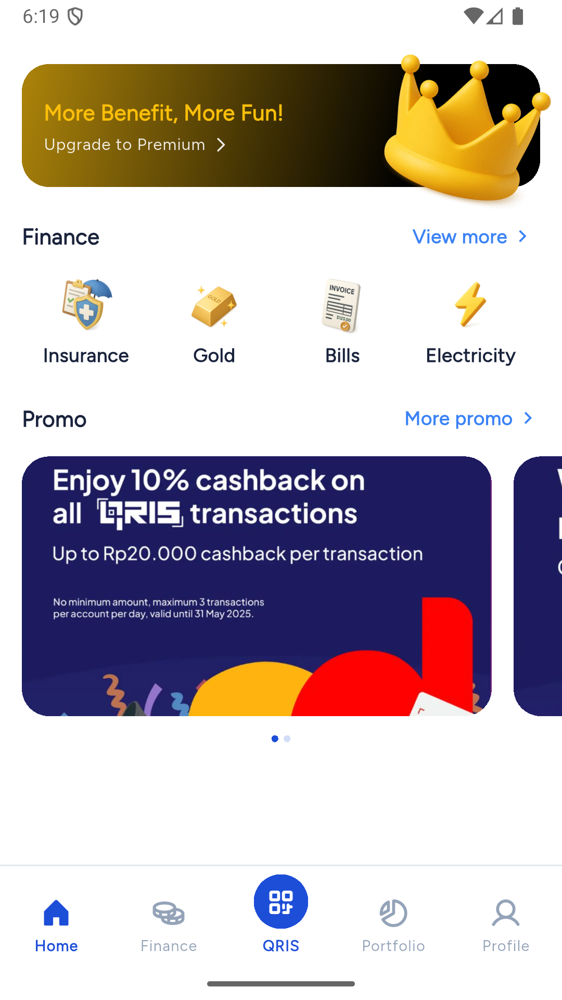
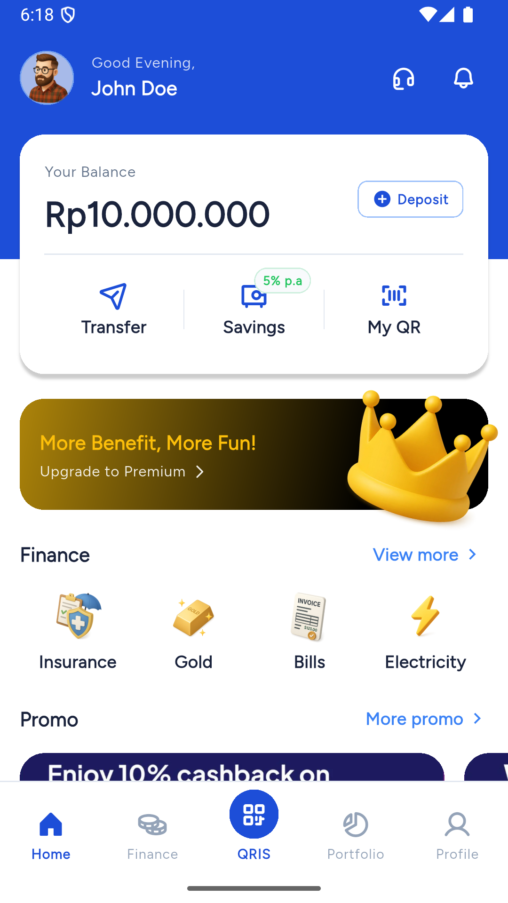
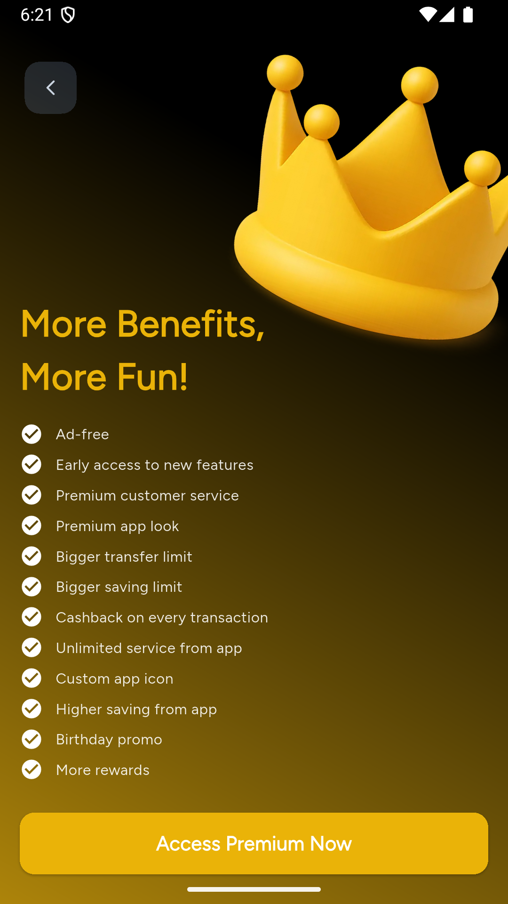
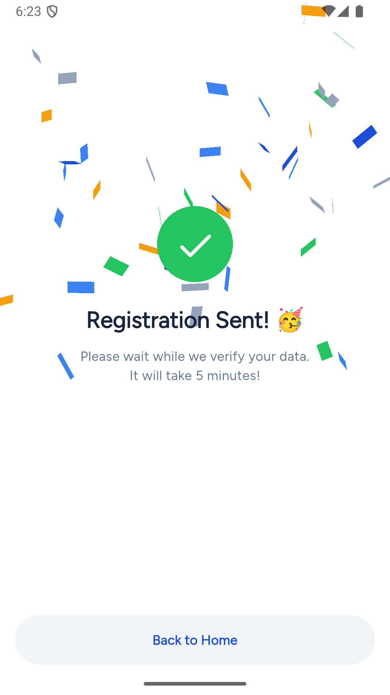

<!-- _class: title-slide -->
# Hugo Radiawan
## Mondooli Premium Experience
Flutter · Melos · Modular Clean Architecture

- Purpose-built to transform Mondooli designs into a scalable premium upsell journey
- Built end-to-end across `app`, `core`, `shared`, `features/premium`
- Target: hiring panel demo highlighting craft, velocity, and collaborative impact

Engineer Case Study 2025 · Confidential — do not distribute

---
## Case Overview & Guardrails
- Mission: replicate the Mondooli premium experience from the official design pack using Flutter, clean architecture, and Melos packages.
- Non-negotiables:
   - Respect Figtree typography, Primary Blue `#1D4ED8`, Dark Text `#1A233C`, and premium gradients.
   - Keep layouts responsive and components reusable across `app`, `core`, `shared`, `premium`.
   - Fetch country data dynamically from `https://restcountries.com/v3.1/all`; no hardcoded lists.
- Confidentiality: assets and code stay within the hiring panel. Please do not forward, post, or demo externally without Mondooli approval.
- Timeline guidance: default 3-day window, but communicate if more time is needed to deliver higher quality.

---
## Objective & Role
- **Mission**: reproduce Mondooli’s premium journey end-to-end while keeping the codebase clean, typed, and scalable.
- **My Ownership**: workspace bootstrap, theming, routing, premium feature implementation, QA/dev handoff notes.
- **Success Criteria**
   - Token fidelity: Primary Blue `#1D4ED8`, Dark Text `#1A233C`, and Figtree typography applied consistently.
   - Responsive + reusable components so every screen holds up on multiple device widths.
   - Dynamic country field powered by `https://restcountries.com/v3.1/all` through `CountryRemoteDataSourceImpl`.
   - Clean architecture boundaries with typed GoRouter routes and testable cubits for each feature slice.

> “You’re hiring someone who can translate ambiguous product briefs into production-ready Flutter modules with guardrails baked in.”

---
## Design Tokens & Reference Assets
- **Primary Blue #1D4ED8** drives CTA, nav, and highlight tiles (`core/lib/src/theme/app_colors.dart`).
- **Primary Dark Text #1A233C** anchors typography; implemented via `LightColors.textPrimary`.
- **Typography**: Google-hosted **Figtree** (weights 300–900) registered under `app/assets/fonts/Figtree`.
- **Icons**: Phosphor icon set mirrors Mondooli glyph system; 3D embellishments aligned with “Thiings” pack from design brief.
- **Spacing/Elevation**: reusable padding constants + HighlightTileTheme ensure consistent card radii and shadows.

---
## Hiring Panel Snapshot

   

      <h3>Core Requirements</h3>
      <ul>
         <li>Pixel-perfect UI + animations (`PremiumBridgePage` gradients, hero crown)</li>
         <li>Clean Architecture boundaries (presentation/domain/data per feature)</li>
         <li>Robust navigation (typed `GoRouter`, bottom nav cubit)</li>
         <li>API readiness with dio + repository abstractions</li>
      </ul>
   

   

      <h3>Impact Signals</h3>
      <ul>
         <li>📦 4-package Melos workspace wired in 48h</li>
         <li>🛠 Shared UI kit (`shared/lib/src/ui`) eliminates duplicate widgets</li>
         <li>🚀 Premium flow instrumented for experimentation hooks</li>
         <li>🧪 Core module seeds bloc-based QA test harness</li>
      </ul>
   

## Screen Gallery · Registration States

   

      <ul>
         <li>Registration form stays consistent with light surfaces and icon-leading inputs.</li>
         <li>Password checklist flips to Mondooli green as soon as each rule is satisfied.</li>
         <li>CTA state progresses from disabled to primary once all validations (including dynamic country data) pass.</li>
      </ul>
   

   

      

         <figure>
            
         </figure>
         <figure>
            
         </figure>
      

   

---
## Screen Gallery · Home Experience

   

      <ul>
         <li>`HomePage` blends GreetingHeader, BalanceCard, PromoCarousel, and Quick Actions.</li>
         <li>`TabsEnum` + `AppBottomNavBarCubit` manage five-tab navigation with QRIS center dock.</li>
         <li>Promo banner “More Benefit, More Fun” drives users to the premium bridge per brief.</li>
      </ul>
   

   

      

            <figure>
               
            </figure>
            <figure>
               
            </figure>
      

   

---
## Modular Architecture (`app/lib/main.dart`)
- **App shell** boots `Core.initialize()` then composes `MaterialApp.router`
- **Core module** (`core/lib/src`)
   - `AppTheme.light`, HighlightTile extensions, typography bootstrap (`AppTypography.init()`)
   - `HttpCubit` + `SharedPreferencesService` injected via `MultiBlocProvider`
- **Shared UI** (`shared/lib/src/ui`): FloatingBackButton, CountrySelector, QuickActionButton
- **Feature slices** like `premium` expose typed routes, cubits, repositories
- Melos `resolution: workspace` keeps dependency graph consistent for all packages

---
<!-- _class: premium-slide -->
## Premium Upgrade Experience · Part 1

   

      <ol>
         <li>
            <strong>Premium Bridge</strong> (`premium_bridge.page.dart`)
            
Gradient hero, animated crown asset, conversion CTA wired to `RegistrationRoute`.

         </li>
         <li>
            <strong>Registration</strong> (`registration.page.dart`)
            
Form fields, password checklist, `CountrySelector` backed by remote/local data sources.

         </li>
      </ol>
   

   

      

        <figure>
          
        </figure>
      

   

---
<!-- _class: premium-slide -->
## Premium Upgrade Experience · Part 2

   

      <ol start="3">
         <li>
            <strong>Success</strong> (`success.page.dart`)
            
Feedback loop, CTA back to home, reuses shared Phosphor icons.

         </li>
         <li>
            <strong>Routing</strong> (`premium.route.dart`)
            
`TypedGoRoute` with multi-provider injection ensures testable cubits.

         </li>
      </ol>
   

   

      

        <figure>
          
        </figure>
      

   

---
## Design System & Tech Stack · Part 1
- Colors + gradients centralized in `LightColors`; premium + base palettes toggled via `AppTheme`
- **Light/Dark Mode**: runtime theme toggle via `ThemeCubit`; persisted to `SharedPreferences` for session continuity
- Typography: bundled Figtree font files (`app/assets/fonts/Figtree`) + GoogleFonts fallback
- State management: `flutter_bloc` cubits for nav + network (`AppBottomNavBarCubit`, `HttpCubit`)
- **Barrel files** pattern (`core.dart`, `shared.dart`, `network.dart`) improves module encapsulation and simplifies imports across packages

---
## Design System & Tech Stack · Part 2
- Linting: repo-level `analysis_options.yaml` cranks Flutter lints to production-ready strictness (e.g., `always_specify_types`, `unused_import` as errors) to lock in code quality.
- Tooling: `melos`, `build_runner`, `freezed`, `json_serializable`, `go_router_builder`, all behind `fvm` so every script pins the same Flutter version.
- Platform targets: Android + iOS (Gradle, Xcode configs already in repo)

---
## API & Data Flow
- Country dropdown hits `https://restcountries.com/v3.1/all` via `CountryRemoteDataSourceImpl` (Dio client, 30s timeout).
- Responses cached locally through `CountryLocalDataSourceImpl` + `SharedPreferencesService` for offline resilience.
- Registration cubit consumes normalized `CountryModel` entities, keeping presentation layer decoupled from API schema.
- Error handling: network faults surface inline helper text, while analytics event logs feed future experimentation.

---
<!-- _class: premium-slide -->
## Roadmap & Hiring CTA
- Productize placeholder tabs (Finance, QRIS, Portfolio, Profile) with dedicated feature packages
- Wire `CountryRemoteDataSourceImpl` to live APIs + caching strategy
- Layer analytics + experimentation on `PremiumBridgePage` CTA
- Extend premium model for tiering & pricing experiments (`features/premium/lib/model.dart`)

**I’m ready to join the Mondooli team**
1. Walk you through the repo live & answer architecture questions
2. Pair on a new feature (e.g., Finance tab) within the existing workspace
3. Ship a pilot build via CI/CD once access is granted

👉 Let’s schedule the technical interview and move this into production.

---
## Submission Package & Runbook
- **Repository**: [Source Code (Google Drive)](https://drive.google.com/file/d/1cLkV0a-KULse2tsTvX0b2a9RdD4hSz0C/view?usp=drive_link)
- **APK Download**: [APK File (Google Drive)](https://drive.google.com/file/d/1JBMRxOQYfd4vn_ZgMXmsGE-Nf0l5P-0T/view?usp=drive_link)
- **Prototype placeholder**: _Embed Figma/Loom link here once recording is ready._
- **APK Size**: ~51 MB raw APK; estimated ~20 MB on Google Play (AAB + delivery optimization) and ~40 MB on App Store.
- **Run locally**
   1. `fvm use`
   2. `melos bootstrap`
   3. `melos run app` (Android or iOS — portrait only)
   4. `melos run build:apk` (to build APK)
- **Credentials/Notes**: none required; API is public. Update `.env` only if new services are added.
- **Submit to**: `novistya.rahmawati@mondooli.com` with deck + repo link per brief instructions.

---
## Confidentiality Reminder
- This deck, source code, and any prototype links are **Engineer Case Study 2025** materials.
- Share only with Mondooli’s hiring panel; avoid posting to public repos, social platforms, or messengers.
- Delete local design assets once the review concludes unless Mondooli extends explicit permission.
- Reach out to `novistya.rahmawati@mondooli.com` for clarifications before distributing anything externally.
